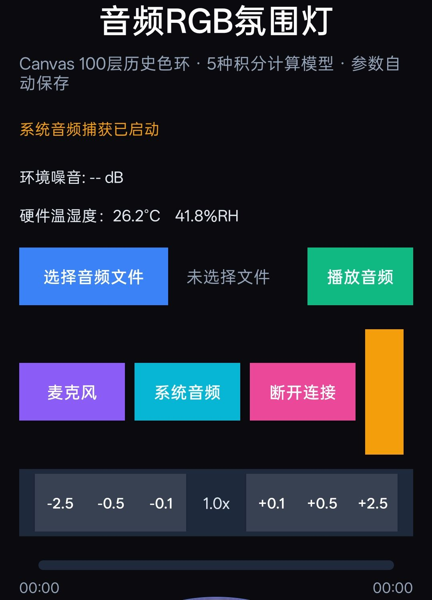
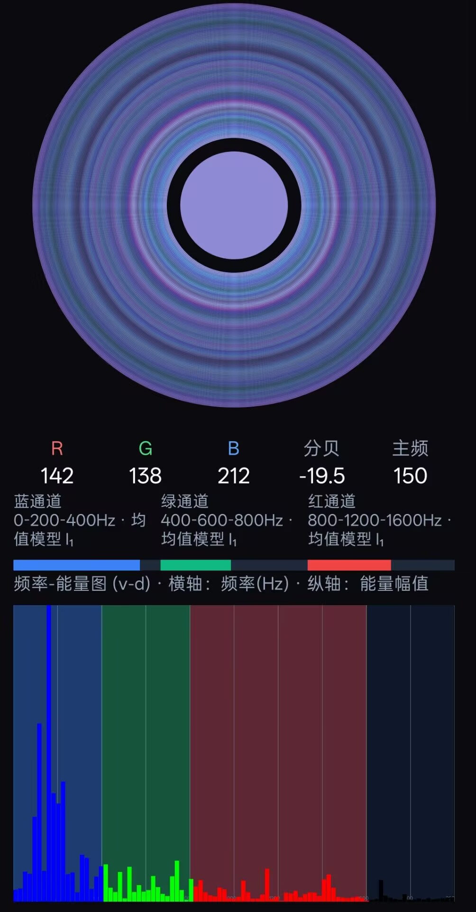
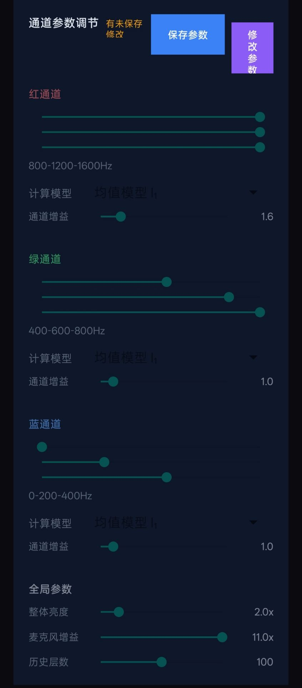

# 音频RGB氛围灯（Android 端）

实时分析手机音频，将频谱映射为 RGB 颜色并绘制「100 层历史色环」与能量频谱图，同时通过经典蓝牙 SPP 把颜色和 16 段电平下发给 ESP32 音乐瀑布屏；还能接收硬件上报的温湿度、实时监听硬件麦克风。

- 应用名称：totoo音频RGB氛围灯
- 包名：`com.example.myapplication`
- 语言：Java
- 最低系统：Android 9.0（API 28）／目标 SDK 33
- 配套固件仓库：[`TOTOOMusicWaterfall_hardware_screen`](https://github.com/totooicu/TOTOOMusicWaterfall_hardware_screen)（ESP32 音乐瀑布屏，PlatformIO 工程）

## 项目仓库

| 项目 | 地址 |
|---|---|
| Android 软件（本仓库） | https://github.com/totooicu/TOTOOMusicWaterfall_software_android.git |
| ESP32 屏幕固件（硬件端） | https://github.com/totooicu/TOTOOMusicWaterfall_hardware_screen.git |

## 界面预览


| 主界面（选择声源 / 蓝牙联动）           | 流水色环与频谱                                      | 通道参数调节                                            |
| ----------------------------------------- | ----------------------------------------------------- | --------------------------------------------------------- |
|  |  |  |

- **主界面**：选择本地音频文件或实时声源（麦克风 / 系统内录），蓝牙一键直连硬件，实时显示环境噪音与硬件温湿度，支持 ±2.5 档变速播放。
- **流水色环与频谱**：Canvas 绘制最多 100 层历史颜色形成同心色环；下方频率-能量图按「蓝/绿/红」三个通道着色，并显示实时 R/G/B、分贝与主频。
- **参数调节**：每个通道独立设置频段边界、5 种积分计算模型与通道增益；全局可调节整体亮度、麦克风增益与历史层数；点「修改参数 → 保存参数」生效，参数自动保存。

## 功能特性

### 音频采集与播放

- **三种声源**：手机麦克风（`AudioRecord`）、系统音频内录（`MediaProjection` + `Visualizer` 前台服务）、本地音频文件播放。
- 播放速度 0.1x 步进、-2.5x ~ +2.5x 调节，带播放进度条。
- 实时计算 FFT、分贝值与主频。

### 颜色映射（核心算法）

- 频谱 0~1600Hz 划分为三个颜色通道，默认：
  - 🔵 蓝通道：0 - 200 - 400 Hz
  - 🟢 绿通道：400 - 600 - 800 Hz
  - 🔴 红通道：800 - 1200 - 1600 Hz
- 每个通道可独立拖动**低/中/高频段边界**、选择 **5 种积分计算模型**（均值模型 I₁、增值模型 I₂、减值模型 I₃、山峰模型 I₄、山谷模型 I₅）并设置通道增益。
- 全局参数：整体亮度、麦克风增益、历史层数（色环层数），修改后自动持久化保存。

### 可视化

- `RingView`：Canvas 逐层叠加历史颜色，形成最多 100 层的同心历史色环。
- `SpectrumView`：频率-能量柱状图，按通道频段分别染蓝/绿/红，横轴频率（Hz）、纵轴能量幅值。
- 实时数值面板：R、G、B、分贝、主频，以及三个通道的频段/模型说明。

### 蓝牙硬件联动

- 经典蓝牙 SPP，自动连接名为 `TOTOOMusicWaterfall` 的 ESP32 设备；
- App 启动自动连接，异常断开每 3 秒自动重连，只有手动点「断开连接」才停止重连；
- 每 50ms 下发一帧「当前 RGB 颜色 + 16 段频谱电平」驱动硬件屏幕；
- 接收硬件每 2 秒上报的温湿度并显示在主界面；
- 「HW麦克风」功能：接收硬件 I2S 数字麦克风上行的 16kHz/16bit PCM，用 `AudioTrack` 实时播放，用于调试硬件麦克风音质（有界队列积压时丢旧帧保证低延迟）。

## 运行环境与构建

1. Android Studio（建议 2021+ 版本，内置 JDK 与 Gradle）。
2. 打开仓库根目录，等待 Gradle 同步。
3. 连接手机（开启 USB 调试）后 Run `app`，或命令行打包：

   ```bash
   # Windows
   gradlew.bat assembleDebug
   # 产物：app/build/outputs/apk/debug/app-debug.apk
   ```

工程内 `app/src/main/cpp` 为模板空壳，无需安装 NDK。

## 权限说明


| 权限                                                                     | 用途                                                 |
| -------------------------------------------------------------------------- | ------------------------------------------------------ |
| `RECORD_AUDIO`                                                           | 麦克风音频采集                                       |
| `BLUETOOTH` / `BLUETOOTH_ADMIN` / `BLUETOOTH_CONNECT` / `BLUETOOTH_SCAN` | 经典蓝牙连接与通信（Android 12+ 需动态授予连接权限） |
| `FOREGROUND_SERVICE`                                                     | 系统音频内录前台服务                                 |
| `READ/WRITE_EXTERNAL_STORAGE`、`CAMERA` 等                               | 工程模板历史权限                                     |

首次启动会合并申请麦克风与蓝牙连接权限；蓝牙未开启时弹出系统开启请求。

## 使用方法

1. 先在手机**系统蓝牙设置**中搜索并配对 ESP32（设备名 `TOTOOMusicWaterfall`，SSP 简单配对，按弹窗确认即可，无需 PIN）。
2. 打开 App，自动连接硬件，主界面显示「蓝牙连接成功」与硬件温湿度。
3. 选择声源：
   - **麦克风**：采集环境声音；
   - **系统音频**：按系统提示授权录屏/内录，采集手机正在播放的音乐；
   - **选择音频文件 + 播放音频**：播放本地音乐并分析。
4. 手机与硬件屏幕同步显示颜色流水（色环 / 屏幕流水区）与 16 段频谱。
5. 点击界面底部参数区域的「修改参数」可调整三通道频段、模型、增益与全局参数，「保存参数」后立即生效并自动保存。
6. 调试硬件麦克风：蓝牙连接后点「HW麦克风」实时收听，再点「停止监听」关闭。

## 代码结构

```
app/src/main/java/com/example/myapplication/
├── MainActivity.java                 # 入口：权限申请、页面装配、蓝牙/温湿度回调
├── controller/
│   ├── AudioController.java          # 声源切换、播放控制、按钮状态、HW麦克风调度
│   ├── BluetoothController.java      # SPP 连接、自动重连、协议组帧/解析
│   ├── RGBController.java            # FFT 分析、三通道颜色映射、16 段电平聚合
│   ├── ParamsController.java         # 通道/全局参数调节页、5 种模型选择
│   ├── MicMonitorPlayer.java         # 硬件上行 PCM 的 AudioTrack 实时播放器
│   ├── HeaderController.java         # 顶部状态、环境噪音、硬件温湿度
│   └── ...
├── service/
│   └── SystemAudioCaptureService.java# MediaProjection 系统内录前台服务
├── view/
│   ├── RingView.java                 # 100 层历史色环
│   └── SpectrumView.java             # 频率-能量柱状图
└── tool/                             # FFT、参数持久化（ParamsManager）等工具类
```

布局按区块拆分为 `app/src/main/res/layout/` 下的 `main_page.xml`、`header_section.xml`、`control_section.xml`、`ring_section.xml`、`rgb_values.xml`、`spectrum_section.xml`、`params_section.xml`、`*_channel_params.xml` 等。

## 通信协议（App ↔ ESP32，SPP）

经典蓝牙 SPP 链路，文本帧以 `\n` 结束；二进制音频帧带固定同步头，与文本帧在同一链路上通过状态机区分。

### App → 硬件


| 帧                                                                                                                                                                    | 说明                           |
| ----------------------------------------------------------------------------------------------------------------------------------------------------------------------- | -------------------------------- |
| `$RRGGBBhhhhhhhhhhhhhhhhhhhhhhhhhhhhhhhh\n` | 联动帧：`$` + 6 位 HEX 当前 RGB + 32 位 HEX（16 个 0~255 电平，对应 0~1600Hz 每 100Hz 一段），固定 40 字符，约 20 帧/秒 |                                |
| `#RRGGBB\n`                                                                                                                                                           | 纯颜色帧（兼容旧固件）         |
| `M1\n` / `M0\n`                                                                                                                                                       | 开启 / 关闭硬件麦克风 PCM 上行 |

### 硬件 → App


| 帧                                  | 说明                                                                                                                                   |
| ------------------------------------- | ---------------------------------------------------------------------------------------------------------------------------------------- |
| `S<temp>,<humid>\n`                 | 温湿度文本帧，每 2 秒一帧，如`S25.3,60.2`                                                                                              |
| `CONNECTED\n`                       | 连接建立问候                                                                                                                           |
| `A5 5A seq lenH lenL [PCM...] xor8` | 麦克风二进制帧：同步头`A5 5A`、1 字节序号、2 字节大端 PCM 长度、N 字节 16kHz/16bit/单声道小端 PCM（每帧 512 采样）、1 字节整帧异或校验 |

## License

未声明开源许可证，默认保留所有权利；如需开源请自行添加 LICENSE 文件。
